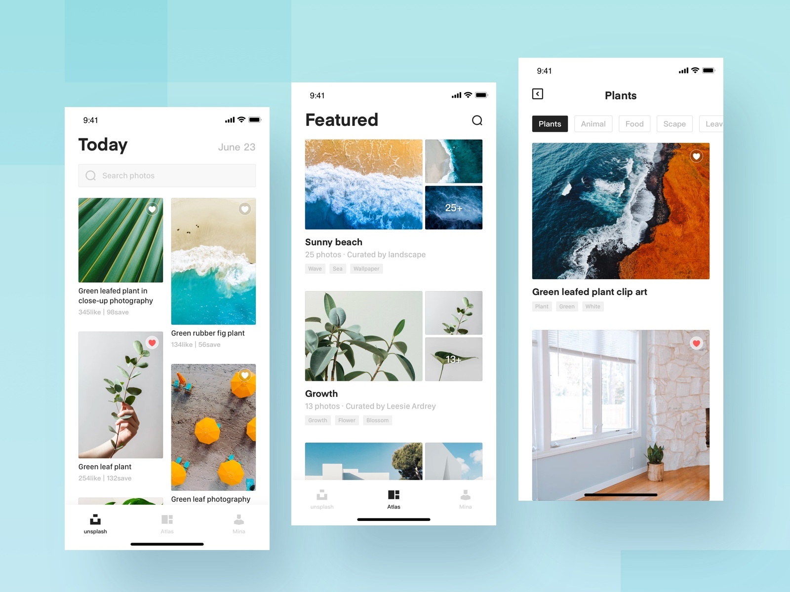
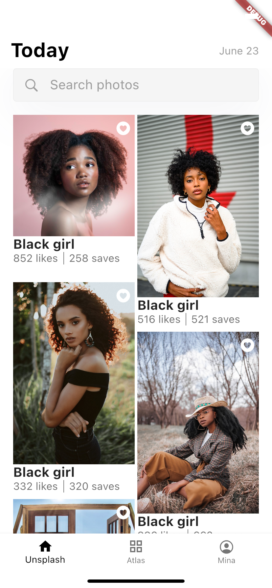
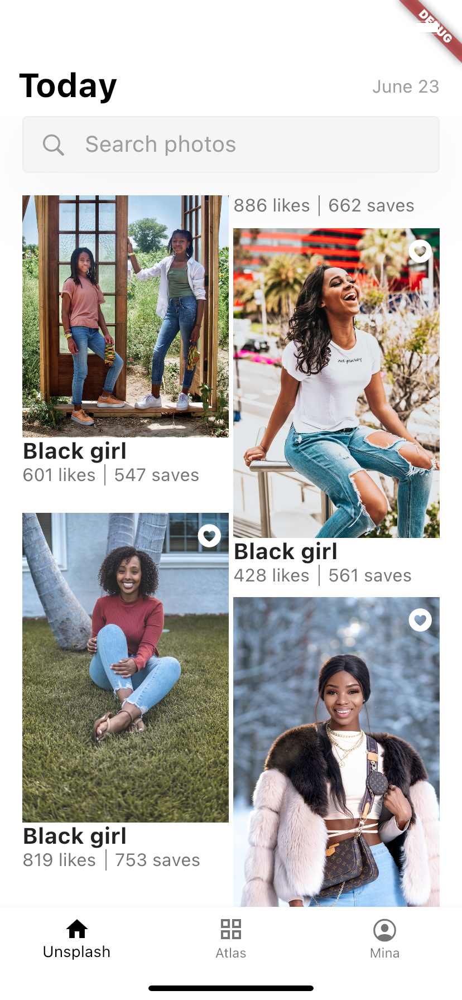
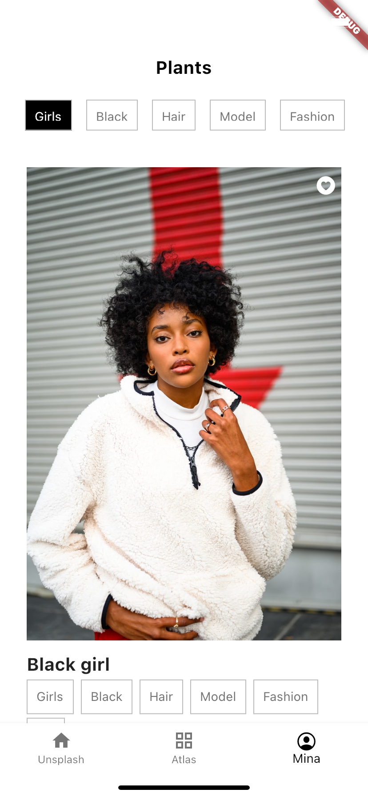
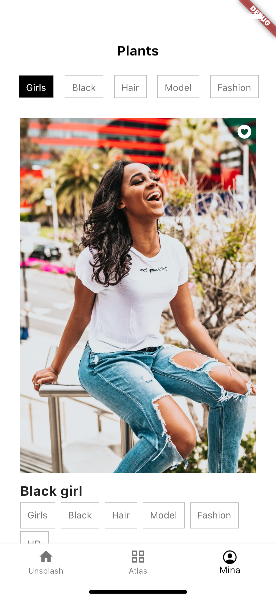
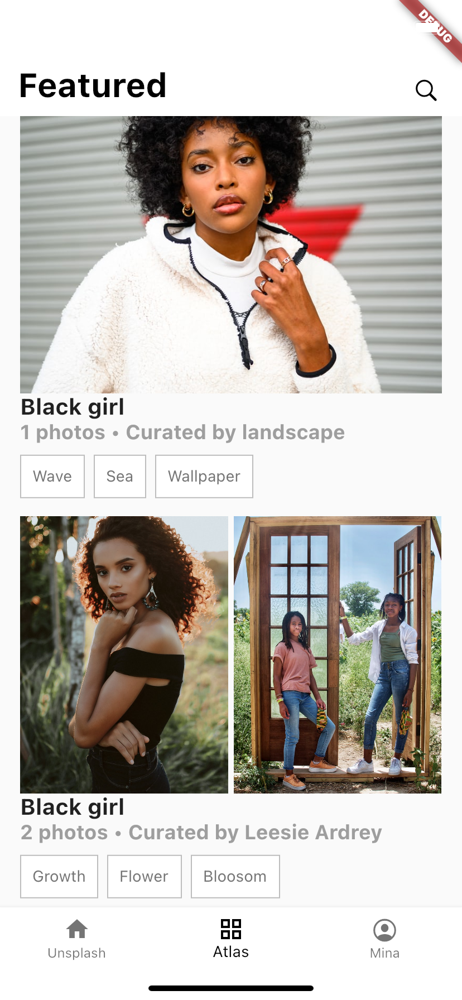
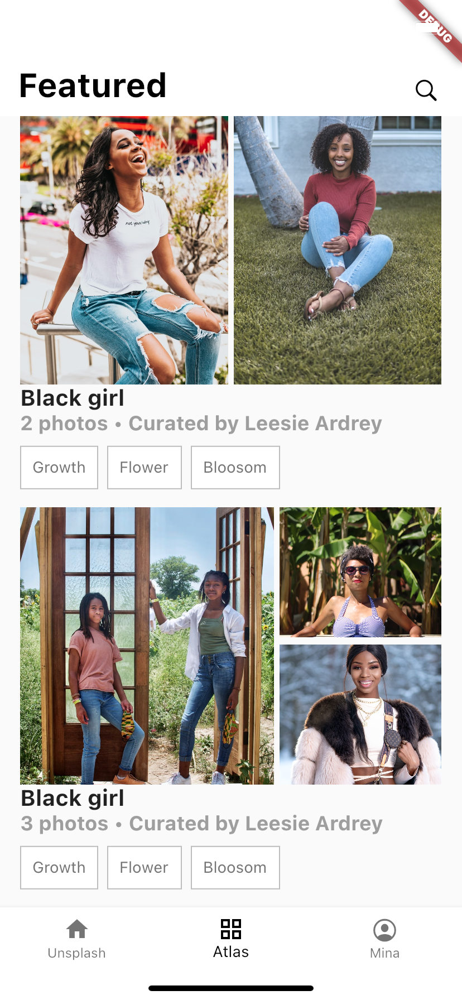

# Elite

Image browsing UI.

## ✨ Requirements
* Any Operating System (ie. MacOS X, Linux, Windows)
* Any IDE with Flutter SDK installed (ie. IntelliJ, Android Studio, VSCode etc)
* A little knowledge of Dart and Flutter
* A brain to think 🤓🤓

## 📖 Inspiration

[**https://dribbble.com/shots/6734901-Unsplash-Com1**](https://dribbble.com/shots/6734901-Unsplash-Com1)

## 📸 ScreenShots
| First Header  | Second Header |
| ------------- | ------------- |
|  |  |
|  |  |
|  |  |

## 🤓 Author(s)
* [**Michael Olusegun**](https://github.com/mikkyboy2005)
* [**Bukunmi Aluko**](https://github.com/bukunmialuko)
